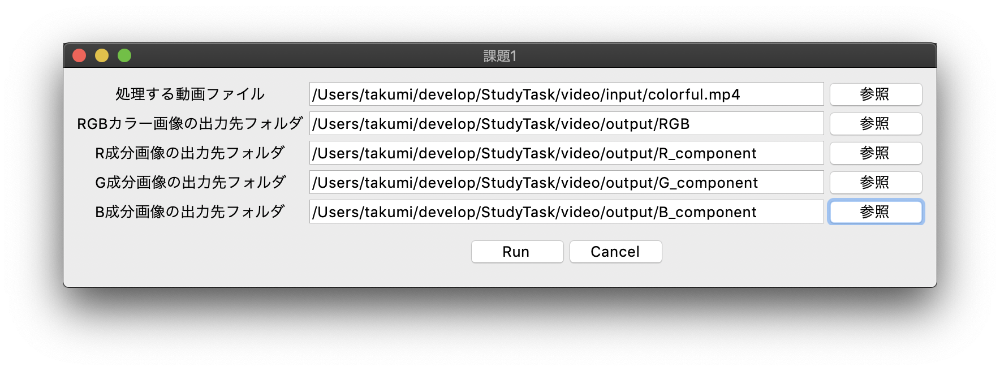
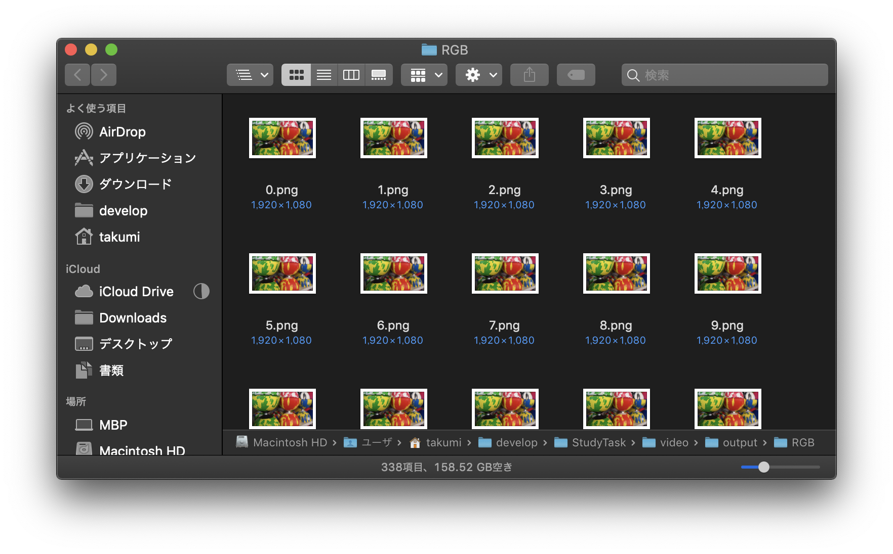
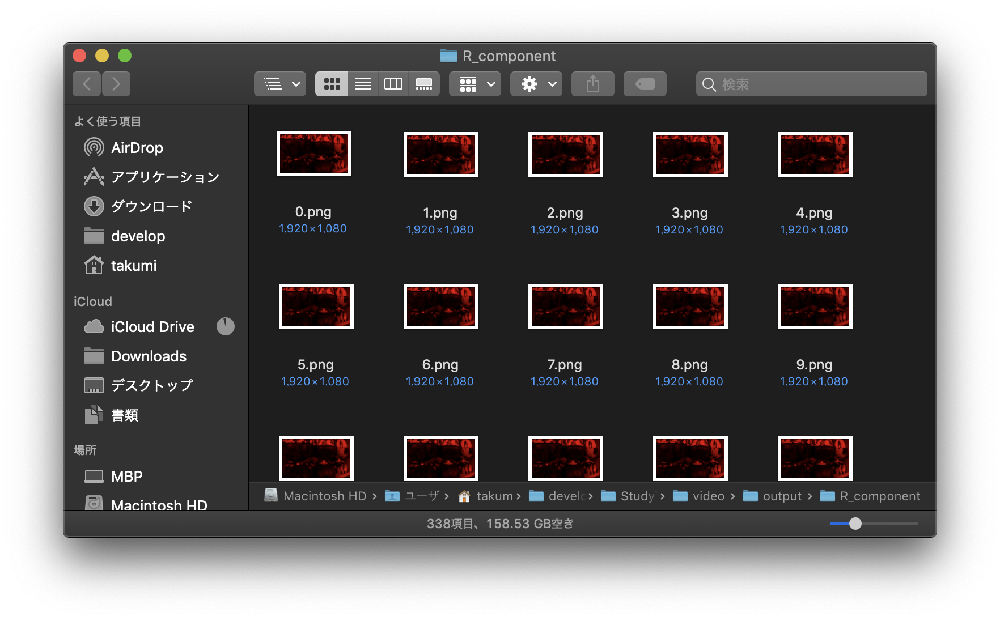
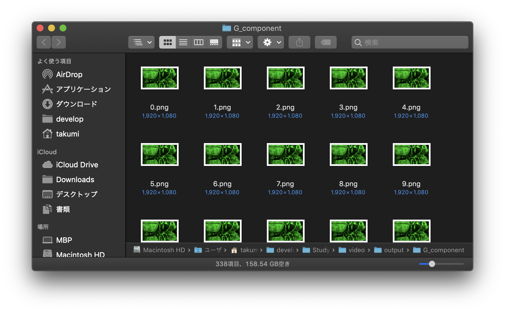
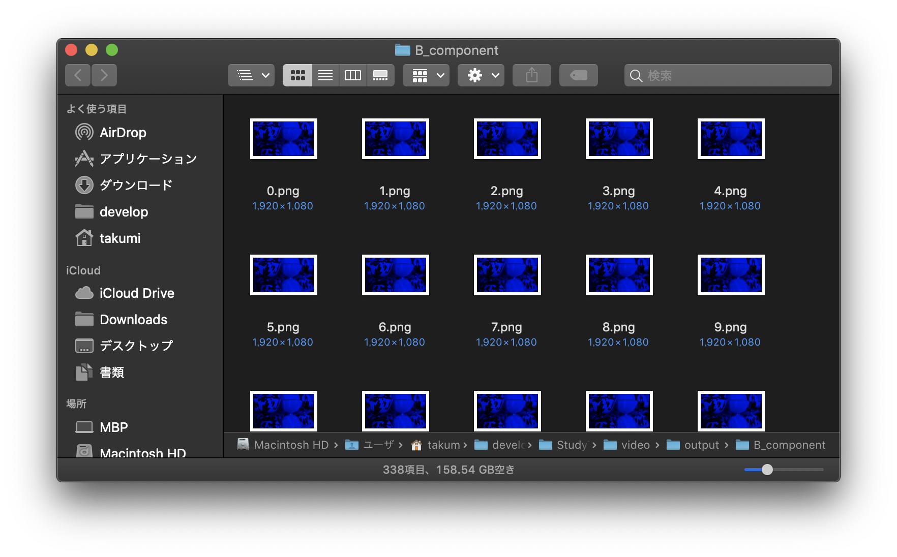
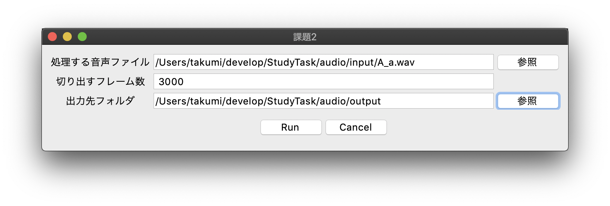
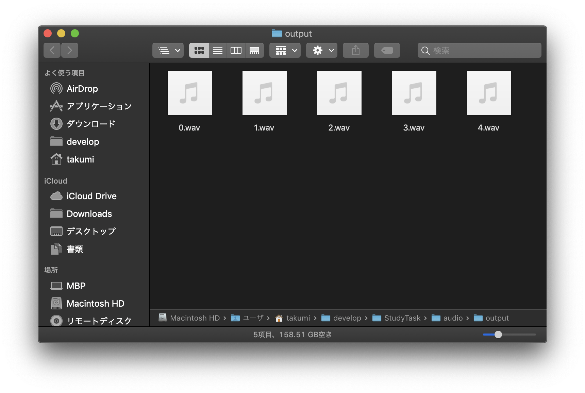

# 研究室課題

## 課題1 動画処理

### 概要

GUIで動画(.mp4)ファイルを選択し、その動画を各フレーム(静止画)に分けて、新たに作成したフォルダに全て出力するプログラムの作成.

#### 条件

1. フレーム出力後に、元動画ファイル及びフレームを出力したフォルダ全て、自動で開くこと

2. フレーム出力は以下の4種類行うこと。
    - RGBカラー画像
    - R成分画像
    - G成分画像
    - B成分画像

3. 出画像の形式はPNGのみ

### 動作例

#### 入力

#### 出力

##### RGBカラー画像出力

##### R成分画像出力

##### G成分画像出力

##### B成分画像出力

## 課題2 音声処理

### 概要

GUIで音声ファイル(.wav)を選択し、その音声を任意のフレーム数ごとに切り出し、切り出し区間のwavファイルとして出力するプログラムの作成.

#### 条件

1. 切り出す数は複数

2. 出力完了後には元音声のフォルダ及び出力音声のフォルダが自動で開くこと

3. 出力形式は.wav

### 動作例

#### 入力

#### 出力

